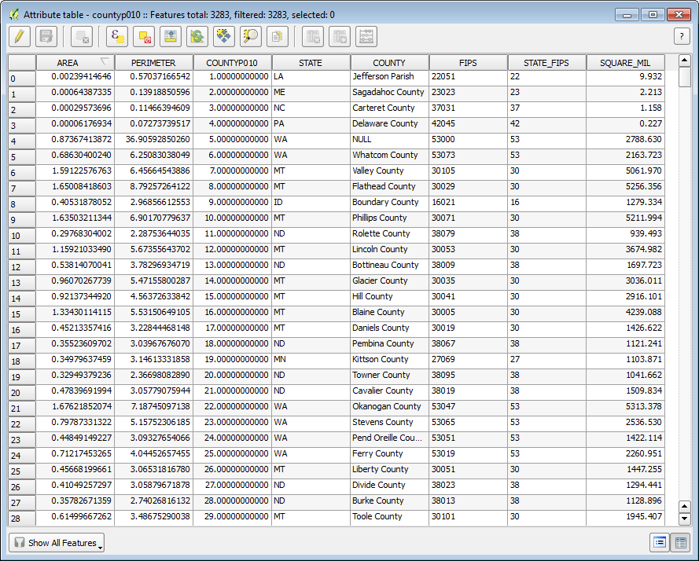
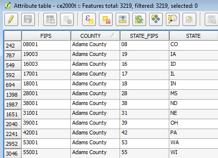
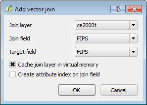
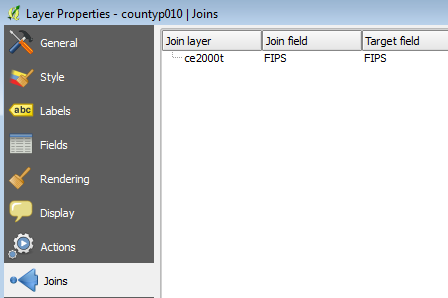
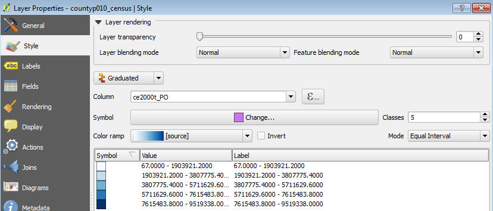
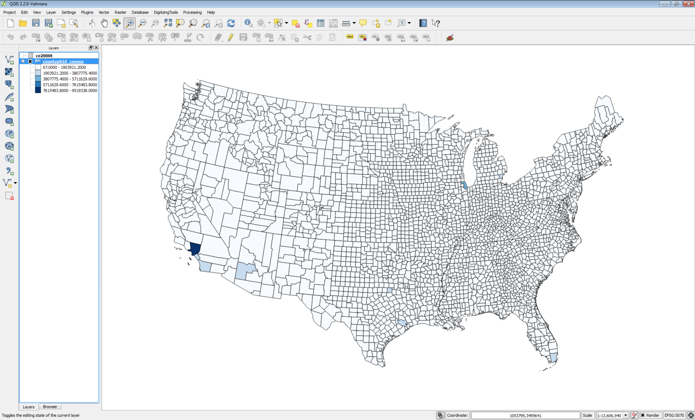
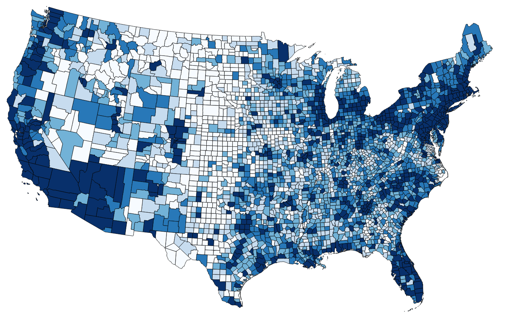
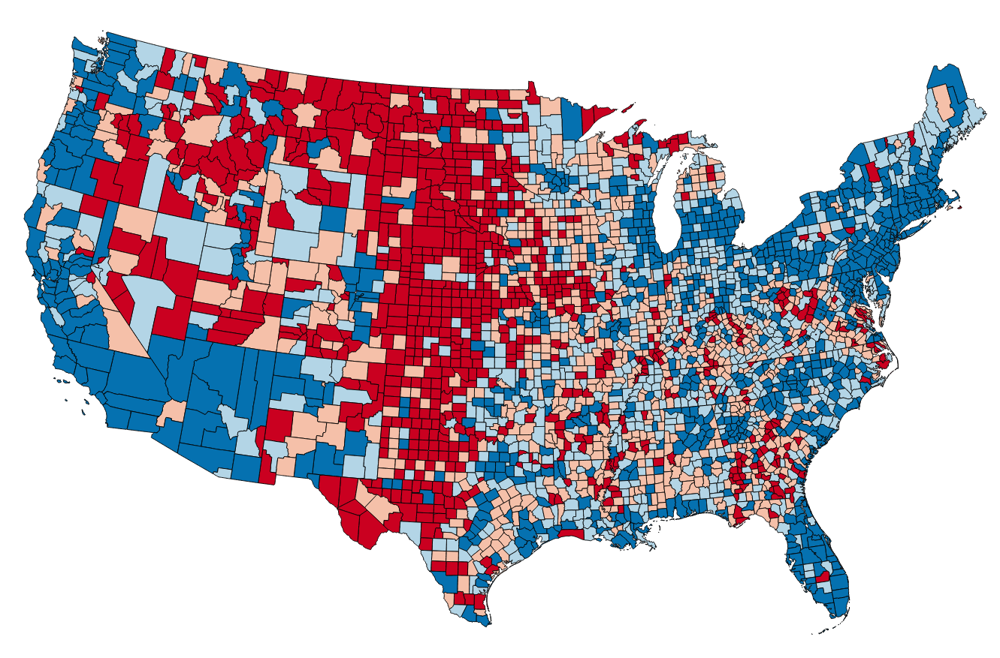

# GST 102: Spatial Analysis
## Lab 2 - Introduction to Geospatial Analysis
### Objective – Understand Attribute Table Joins and Data Classification

Document Version: 9/18/2014

**FOSS4G Lab Author:**
Kurt Menke, GISP  
Bird's Eye View GIS

**Original Lab Content Author:**
Richard Smith, Ph.D.  
Texas A&M University - Corpus Christi

---

Copyright © National Information Security, Geospatial Technologies Consortium (NISGTC)

The development of this document is funded by the Department of Labor (DOL) Trade Adjustment Assistance Community College and Career Training (TAACCCT) Grant No.  TC-22525-11-60-A-48; The National Information Security, Geospatial Technologies Consortium (NISGTC) is an entity of Collin College of Texas, Bellevue College of Washington, Bunker Hill Community College of Massachusetts, Del Mar College of Texas, Moraine Valley Community College of Illinois, Rio Salado College of Arizona, and Salt Lake Community College of Utah.  This work is licensed under the Creative Commons Attribution 3.0 Unported License.  To view a copy of this license, visit http://creativecommons.org/licenses/by/3.0/ or send a letter to Creative Commons, 444 Castro Street, Suite 900, Mountain View, California, 94041, USA.  

This document was original modified from its original form by Kurt Menke and continues to be modified and improved by generous public contributions.

---

### 1. Introduction

GIS data comes in many formats. As you collect data from various sources on the internet, you will realize that the data you acquire will not always be spatially enabled. There may be a spatial component to the data, but it is not yet a GIS dataset. For example, you may have an Excel spreadsheet with county population statistics. The data has a spatial component, county designation, however, it is not data that is ready to be mapped.  In this lab you’ll learn how to perform a table join to attach data to the attribute table of an existing GIS dataset. You will then learn how to classify the data.

This lab includes the following tasks:

+ Task 1 – Data Exploration and Joins

+ Task 2 – Data Classification

### 2	Objective: Explore and Understand Geospatial Data Models

In this lab we will look at some tabular data and determine how to join it to an existing dataset. This is a common data preparation step before we begin an analysis. 

Join – Appending the fields of one table, to those of another table, based on a common attribute. Typically, joins are performed to attach more attributes to the attribute table of a geographic layer. 

Classification – the process of breaking up data values into meaningful groups.

### 3	How Best to Use Video Walk Through with this Lab

To aid in your completion of this lab, each lab task has an associated video that demonstrates how to complete the task.  The intent of these videos is to help you move forward if you become stuck on a step in a task, or you wish to visually see every step required to complete the tasks.

We recommend that you do not watch the videos before you attempt the tasks.  The reasoning for this is that while you are learning the software and searching for buttons, menus, etc…, you will better remember where these items are and, perhaps, discover other features along the way.  With that being said, please use the videos in the way that will best facilitate your learning and successful completion of this lab.

### Task 1 Data Exploration and Joins
	
The data for this lab includes two shapefiles: U.S. State boundaries (statep010.shp) and U.S. County boundaries (countyp010). Both layers cover only the lower 48 contiguous states. There are also two tabular datasets: crime (Crimes_county.dbf) and U.S. Census data (ce2000t.dbf) for counties. In order to map the data in the two tables we will need to join them to the county shapefile. In order to perform such a join there needs to be a common attribute between the table and the shapefile. 

2.	Open QGIS Desktop 2.2.0 and add the County shapefile.
3.	Open the attribute table and examine the contents (figure below).

4.	You can see that there are 3,283 records in the table. What kind of attributes does this data set have? The Area and Perimeter fields are created as part of the file format (shapefile). These represent the area and perimeter of each feature in map units. Since this dataset is in the Geographic Coordinate System these units are in decimal degrees. This is a difficult unit to work with so these don’t add much information. The Square_Mil field at the far right is much more useful. This holds the area of each polygon in square miles. CountyP010 is an unique ID. Then there are fields for State abbreviation, County name and FIPs codes. 

FIPS stands for Federal Information Processing Standards. They are unique codes for census designations. Each state has a FIPS code and each county has a FIPS code. This data set has a column for the State_FIPS but not the county fips alone. The first two digits in the FIPS column are the State FIPS code. The last three digits in the FIPS column are the County FIPS code. Combining both State and County FIPS codes provides a unique ID for each county in the U.S.

With this data you can identify the state and county names and the size of each county that is it. Now you will examine one of the standalone tables. 

5.	Close the Attribute table. 
6.	To add a table click the Add Vector Data button and browse to the lab data folder. Set the file type filter to All Files (*)(*.*). Select the ce2000t.dbf file and add it to QGIS Desktop.
7.	Right click on the table and choose Open Attribute Table from the context menu. Examine the attributes.
8.	This table contains many fields of socioeconomic data such as total population, population by age, population by gender etc. 
9.	What field can be used to join this to the Counties attribute table? At first you might think the County column would work. Click the County column header so that an upward facing arrow appears. Remember that this allows you to toggle back and forth between an ascending and descending sort of the data. Notice that there are numerous Adams County entries from several states (figure below). Therefore, County name is not a unique ID. However, the FIPS column is a unique ID that will be used to join to the FIPS column in the shapefile.

10.	Close the table.
11.	Right click on the countyp010 layer and choose Properties from the context menu.
12.	Click on the Joins tab. This is where you configure joins for the layer. Click the Add Join button  .
13.	The Add vector join window opens. The Join layer is the table you will join to the shapefiles attribute table. Since you only have one table in your Table of Contents there is only one choice: ce2000t. Since you’ve previewed both the county layer attribute table and ce2000t you know that the Join field is FIPS and the Target field is also FIPS (figure below). 

NOTE: In this example both join fields have the same name. However, this is not a requirement. Both fields do need to have the same data type. For example, they need to both be text fields or both integer fields.

14.	Click OK.
15.	You will see the join show up in the Join window (figure below). The join has now been created.

16.	Click OK on the Layer Properties window to close it.
17.	Re-open the countyp010 attribute table.  You will see all the additional fields appended to the right side.
18.	This join exists only within this QGIS Desktop document. In other words the data haven’t been physically added to the shapefile. However, within this map document the new fields will act as all the others. 
19.	To make the join permanent simply right click on the layer and choose Save as…This will allow you to save a new copy of the countyp010 shapefile with the new attributes included. Name the new shapefile countyp010_census.shp (figure below).

20.	You can now remove the original county layer from the map. Right click and choose Remove. 
21.	Save the project as Lab 2.qgs

### Task 2 Classification
Now that you’ve joined data to the counties layer you will explore different ways to symbolize the data based on the new attributes.

1.	Open QGIS Desktop 2.2.0 and open Lab 2.qgs if it is not already open.
	
2.	From the menu bar choose Project -> Project Properties, click on the CRS tab and ensure that Enable ‘on the fly’ CRS transformation is checked. 
	
3.	In the Filter window type 5070. This is the EPSG code for the Albers Equal Area projection for the continental U.S. Select the NAD83/CONUS coordinate systems for the map and click OK.

4.	The data should now resemble the figure below.
	

5.	Open the Layer Properties for the county_010_census layer and click on the Style tab.
6.	Instead of the default Single Symbol renderer choose the Graduated renderer. This allows you to choose a numeric field and classify the data into categories.
7.	Choose ce2000t_PO as the Column. This field has the total population in 2000. Take all the defaults (in the figure below) and click OK.

8.	The color ramp may differ but your map should resemble the figure below. QGIS has divided the data values into 5 groupings, and applied a color ramp across the categories. This first classification does not tell much of a story.

9.	Open up the Layer Properties -> Style tab again. The default classification Mode used was Equal Interval. This default mode attempts to create classes with the equal data value intervals. Change the Mode to Natural Breaks (Jenks). Notice the data values change. This is an algorithm that calculates natural groupings of a series of data values. Click OK.
10.	This is a more informative portrayal of the data. There large population centers are more visible now (figure below).

11.	Open up the Layer Properties -> Style tab again. Change the Mode to Quantile (Equal Count). Notice the data values change. This is an algorithm that attempts to put the same number of features into each class. Click OK.
12.	This is a much more informative depiction of total population (figure below).

NOTE: When a map is presenting data values it is called a chloropleth map.

13.	Open up the Layer Properties -> Style tab again. In addition to changing the mode, you can change the number of classes. Change the number of classes to 4 and click Apply.
14.	You can also change the Color ramp. Click the drop down arrow to the right of Color ramp and choose RdBu   then click on one of the symbols to have the new color ramp applied. Click Apply. This highlights rural counties with a red color (figure below).

15.	You can also click the Invert option to have the color ramp reversed. 
NOTE: Sometimes you need to change to another color ramp, and back to the one you want to use, to have the Inversion take effect. 
16.	Finally, you can change the Labels. Instead of the bottom class having values of 67-11566.75, you can double click on the label text for a class and change it. For example, you could change the least populated class label to ‘Rural’.

### 5 Conclusion
In this lab, you learned to join tabular data with a spatial component to a shapefile. Once that was complete, you were able to classify the data and produce different renderings of that data. Between the various classification modes, choosing the number of classes and the color ramp you have endless possibilities for displaying numeric data. The key is to remember what data pattern you are trying to share with the map reader. Then you must find a classification theme that will tell the story. These are common techniques for dealing with numeric data on maps. 

### 6 Discussion Questions

1.	Describe the use of a join in GIS?
2.	Why might you want to preserve a join outside of a QGIS map document by exporting the joined layer, versus just working with the join in the map document?
3.	Why would you classify data?

### 7 Challenge Assignment

There are several more datasets in C:\GST102\Lab 2\Data\ChallengeData. There is a World_Countries shapefile and two tabular datasets: CO2_Readings_World.xls and RenewableEnergy_Percentages.dbf. Both of these tabular formats can be brought into QGIS Desktop as tables. Identify the fields by which these two tables can be joined to the World_Countries shapefile. NOTE: You can add additional joins to a shapefile by just repeating the process in Task 1  

Once you have joined the data make two maps: 1) Showing CO2 readings by country and 2) RenewableEnergy_Percentages by country.

 

