# GST 102: Spatial Analysis
## Lab 3 - Advanced Attributes and Spatial Queries for Data Exploration
### Objective – Understanding Attribute Queries and Spatial Queries

Document Version: 9/18/2014

**FOSS4G Lab Author:**
Kurt Menke, GISP  
Bird's Eye View GIS

**Original Lab Content Author:**
Richard Smith, Ph.D.  
Texas A&M University - Corpus Christi

---

Copyright © National Information Security, Geospatial Technologies Consortium (NISGTC)

The development of this document is funded by the Department of Labor (DOL) Trade Adjustment Assistance Community College and Career Training (TAACCCT) Grant No.  TC-22525-11-60-A-48; The National Information Security, Geospatial Technologies Consortium (NISGTC) is an entity of Collin College of Texas, Bellevue College of Washington, Bunker Hill Community College of Massachusetts, Del Mar College of Texas, Moraine Valley Community College of Illinois, Rio Salado College of Arizona, and Salt Lake Community College of Utah.  This work is licensed under the Creative Commons Attribution 3.0 Unported License.  To view a copy of this license, visit http://creativecommons.org/licenses/by/3.0/ or send a letter to Creative Commons, 444 Castro Street, Suite 900, Mountain View, California, 94041, USA.  

This document was original modified from its original form by Kurt Menke and continues to be modified and improved by generous public contributions.

---

### 1. Introduction

In this lab students will explore data and decipher the data fields using a data dictionary table. The students will then perform queries on Census data using QGIS Desktop. The students will also create a buffer, and learn the importance of buffering in combination with spatial queries.
This lab includes the following tasks:

+ Task 1 – Using Data Dictionaries and Attribute Selections

+ Task 2 – Buffering and Spatial Queries

###2 Objective: Understanding Attribute Queries and Spatial Queries

The objective of this exercise is to learn how to query attribute data and how to derive information from attribute data. You will learn how to perform both attribute and spatial queries.

### 3 How Best to Use Video Walk Through with this Lab

To aid in your completion of this lab, each lab task has an associated video that demonstrates how to complete the task.  The intent of these videos is to help you move forward if you become stuck on a step in a task, or you wish to visually see every step required to complete the tasks.

We recommend that you do not watch the videos before you attempt the tasks.  The reasoning for this is that while you are learning the software and searching for buttons, menus, etc…, you will better remember where these items are and, perhaps, discover other features along the way.  With that being said, please use the videos in the way that will best facilitate your learning and successful completion of this lab.

### Task 1 Using Data Dictionaries and Attribute Selections
	
Data dictionaries (a.k.a., lookup tables) are usually in an electronic format. They are often included with datasets so that we can understand the type of data stored in a given field. They become necessary because attribute columns can only be so long. For example, column names in a shapefile are limited to 10 characters. Therefore, data creators often resort to using codes as field names. Often the only way to know what type of data is stored in a given field is to review the data dictionary (figure below).  

In this task, we will look at the data dictionary given to us with some census data for the lower 48 U.S. states. The census data captures many attributes about the U.S population from the 2010 Census. These attributes contain a lot of useful information.  The ability to query the data allows us to expose trends in the data.

#### Task 1.1 Using a Data Dictionary
1.	The data for this lab is located on the lab machine at: C:
2.	GST102/Lab 3/Data.
2.	Open QGIS Desktop 2.2.0.
3.	Click on the Browser tab. If the Browser tab is not enabled from the menu bar choose View -> Panels -> Browser.
4.	Browse to the Lab 3 Data folder, right click on the Data folder and choose Add as a Favourite. 
5.	Expand the Favourites and browse to C:/GST102/Lab 3/Data/Census folder (Figure 2). Select the State_2010Census_DP1 layer and drag it onto the map canvas to add it to QGIS Desktop.

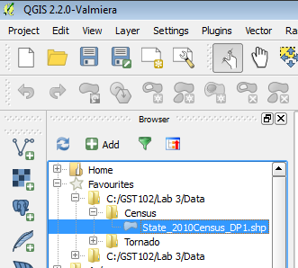

6.	Now you’ll set the coordinate reference system for the map. From the menu bar go to Project ->Properties. Enable ‘on the fly’  CRS transformation and put the map into NAD83/Conus Albers (EPSG:5070).
7.	Save the project as Lab 3 Census.qgs.
8.	Open the attribute table for the State_2010_DP1 layer. 
9.	There are a lot of attribute columns.  It is clear that a naming convention has been used, but there is no way to understand what data in contained in each field by the field names alone. Close the table.
10.	The data dictionary is located in DP_TableDescriptions.xls. Click the Add vector data button and browse to the Lab 3/Data/Census folder. If you don’t see the spreadsheet, change the file filter in the lower right corner to All files (*)(*.*). Select the spreadsheet and click Open (figure below). 

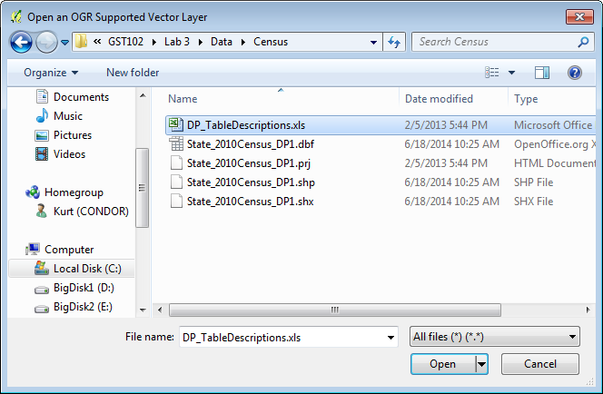

11.	We have been asked to map the male population under age 5 for the lower 48. To determine which field contains that data, right click on the Table and choose Open attribute table.
12.	You can see that the male under 5 years data is contained in the DP0010021 field. Close the Table.
13.	 Now you will style the layer with the under 5 years data. Open the Layer Properties and go to the Style tab. Use the criteria below. When finished your map should resemble figure below.

	a.	Choose a Graduated renderer.

	b.	Column = DP0010021

	c.	Mode = Quantile (Equal count)

	d.	Classes = 5

	e.	Color ramp = Blues

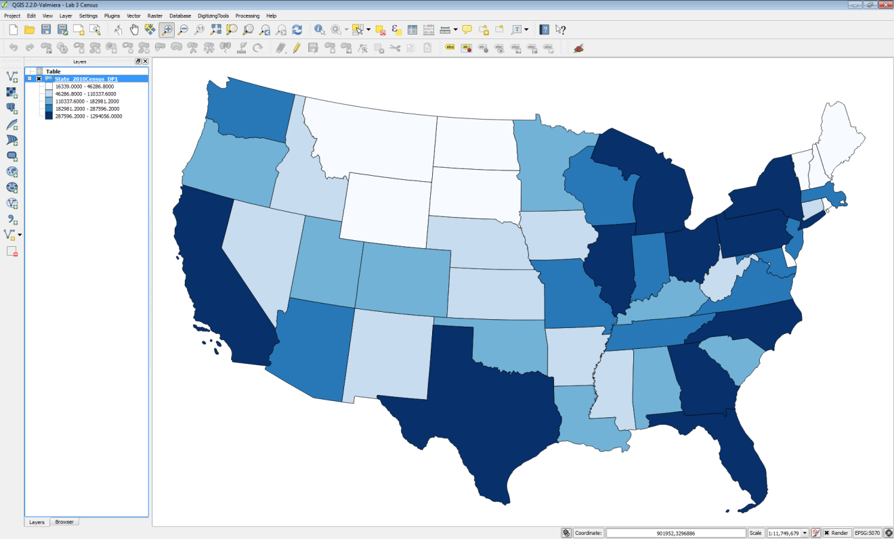

14.	Save your map. You will be using this QGIS Desktop project in task 1.2

#### Task 1.2 Attribute Selections

1.	If you don’t have it open, open the Lab 3 Census.qgs project.
2.	Using the map you have just created in Task 1.1 you will now perform some queries against the census data.
3.	Open the attribute table for the Census layer. Click the Select features using an expression button  . The Select by Expression window opens.
4.	You have mapped the states by the under 5 male population. Now you want to know which states have a total population less than 1,000,000. The figure below shows the layout of the Select by Expression window.

	a.	Fields and Values are included in the list of functions. You can expand the list to see the fields in the dataset.

	b.	There are a suite of operators to use in building your expression.

	c.	The expression window. Double clicking on Fields, Values and Operators will place those objects in the expression window. It is best to build your expression this way instead of trying to type it. This will allow you to avoid syntax errors.

	d.	Select options: By default, you will create a new selection. However, you can choose to add to an already existing selection, have records removed from an existing selection, or select from an existing selected set. 

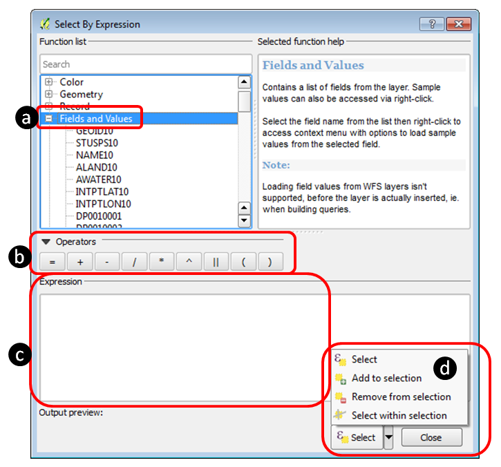

5.	First, you’ll have to refer to the data dictionary to see which field contains the total population values. To select those states with a total population less than 1,000,000 you will:
	
	a.	Double click on field DP0010001

	b.	Expand the Operators in the Function list and choose ‘<’

	c.	Type in the value of 1000000. NOTE: Since you want a specific numeric value, you will type it in here. You could choose the DP0010001 field and then click on Load values: all unique and see if there is a value of exactly 1000000. However, it is unlikely that you will find a precise even value like that. In these cases, type the value in without thousand separator commas. Also note that numeric values do not receive quotes (“) or tics (‘).

6.	Your expression will look like the figure below. Click Select.

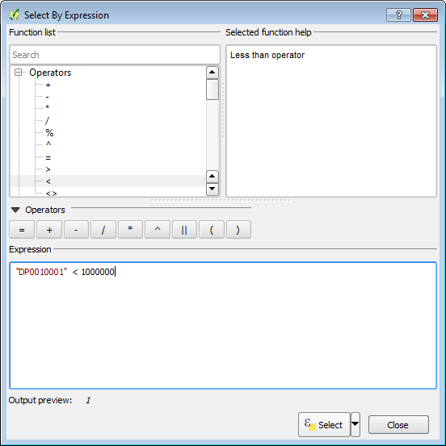

7.	The selected records are highlighted in blue in the attribute table. 
8.	Click the Show All Features dropdown and choose Show Selected Records. Now you are viewing only the 7 selected records. Click on the DP0010001 header to sort the selected records by total population. Now you can easily see which state has the highest and which has the lowest population among the seven selected (figure below). 

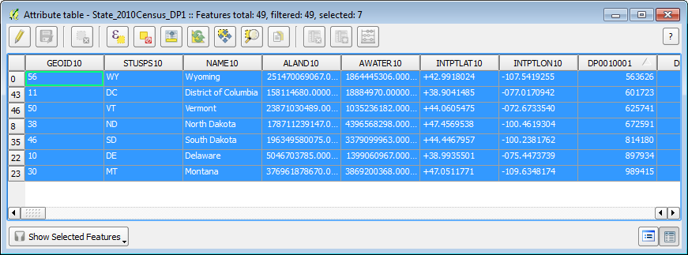

9.	Close the attribute table.
10.	The corresponding features are selected in the map as well. Your map should now resemble the figure below.

[States with a Total Population Less Than 1,000,000 Selected](figures/States_with_a_Total_Population_Less_Than_1,000,000_Selected.png "States with a Total Population Less Than 1,000,000 Selected")

11.	Re-open the attribute table and create an expression selecting the states with a total population greater than 10,000,000.  Your map should now match the figure below with seven selected states.

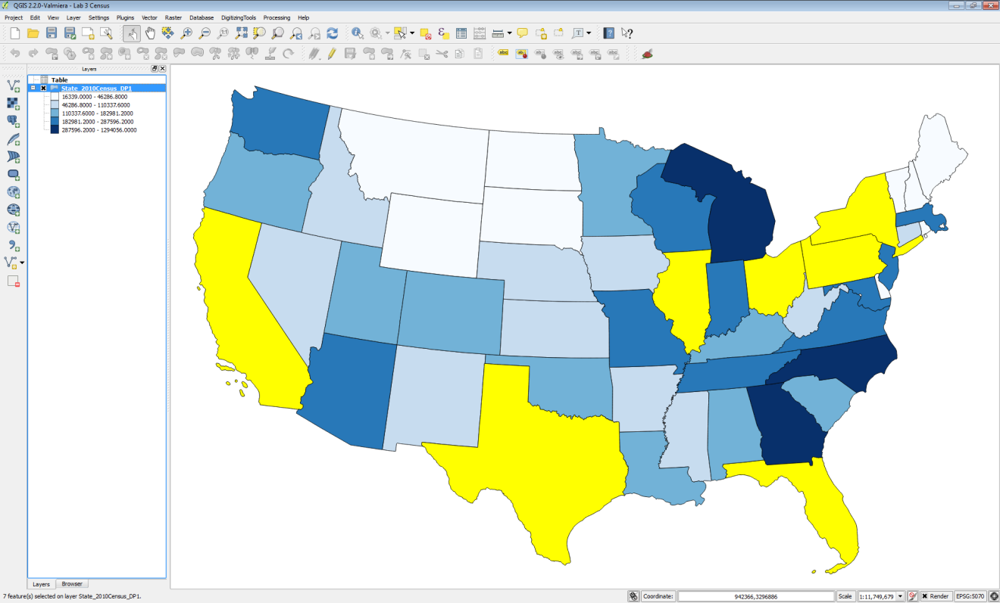

### Task 2 Buffering and Spatial Queries
Buffering is a key vector analysis tool in GIS. It gives us the ability to create a new GIS layer representing a buffer distance from some map feature(s).

#### Task 2.1 Running the Buffer Tool

1.	Open QGIS Desktop 2.2.0 and open Lab 3/Data/Tornado/Tornado.qgs.
2.	The redline represents a tornados path through a residential area. The approximate area of damage was 900 meters around the path. The green polygons represent schools in the area, the parcels are in yellow and the roads black lines.
3.	From the menu bar choose View -> Show Bookmarks. The Geospatial Bookmarks window opens. Select the Tornado path bookmark and choose Zoom to (figure below). 

NOTE: you can add as many geospatial bookmarks as you need. Simply set the map extent as you like and choose View -> New Bookmark and give it a name. It is a convenient way to store important map extents.

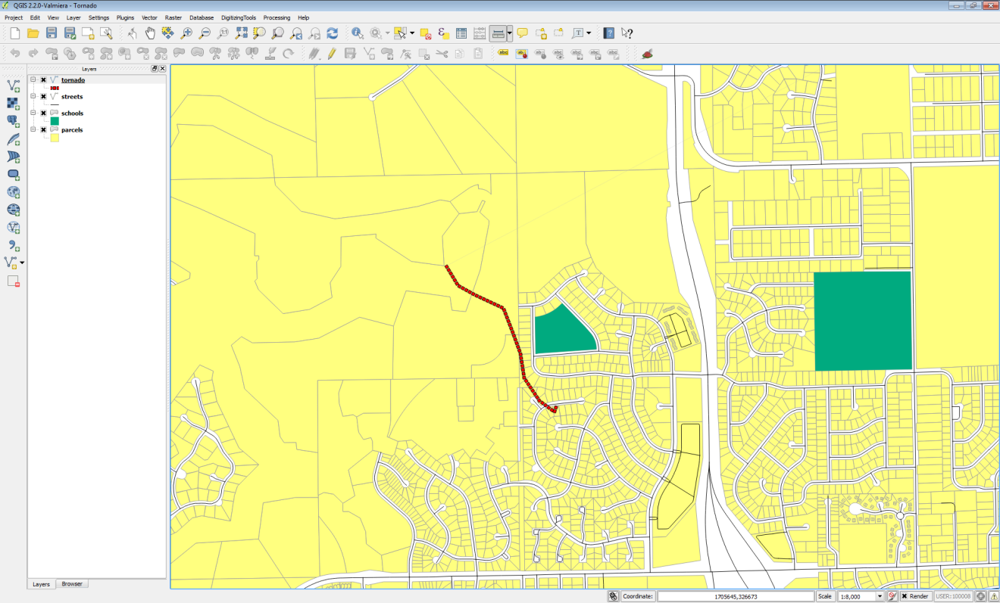

4.	To identify the area impacted by the tornado you will create a 900 meter buffer around the path. From the menu bar choose Vector -> Geoprocessing tools -> Buffer(s). Fill out the Buffer tool with the parameters seen in the figure below. Click OK to run the tool, and click Close when it has finished.

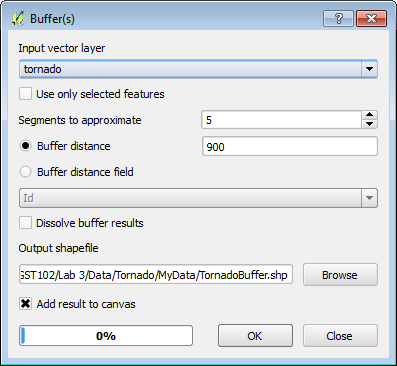

5.	A new polygon layer is created that covers all the land 900 meters from the tornados path. You will need to make the new layer semi-transparent so that you can see what parcels, schools, and roads were affected. Open the Layer Properties for the buffer layer and choose the Style tab. Set the Layer transparency to 50% (figure below).

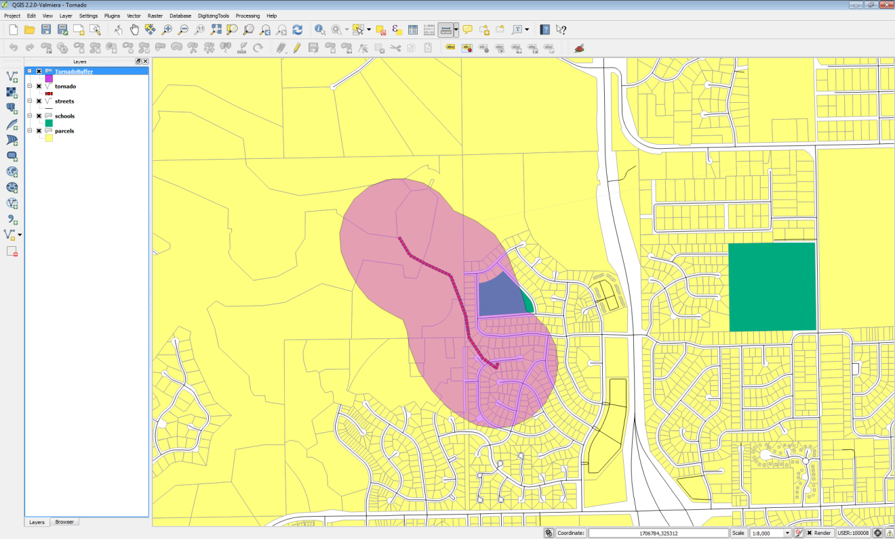

Looking at the result we can immediately see the areas affected by the tornado. This is a prime example of how buffers are used. 
7.	Save your map.

#### Task 2.2 Performing Spatial Queries
Here you will learn how to identify exactly which parcels were affected by the tornado.

1.	Begin with the QGIS Desktop map as you saved it at the conclusion of Task 2.1.
2.	From the menu bar choose Vector -> Research tools -> Select by location.
3.	Using select by location you can conduct spatial queries. In other words, which parcels overlap with the tornado buffer? Fill out the form as in the figure below. Click OK and Close. 

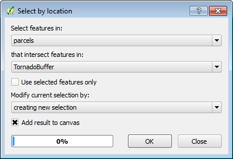

4.	The parcels that intersect the tornado buffer are now selected. However, the default yellow selection color is very close to the yellow color of the parcels. To change the selection color go to the menu bar choose Project -> Project Properties and click on the General tab. Change the Selection color to a blue color so the selected parcels stand out better (figure below).

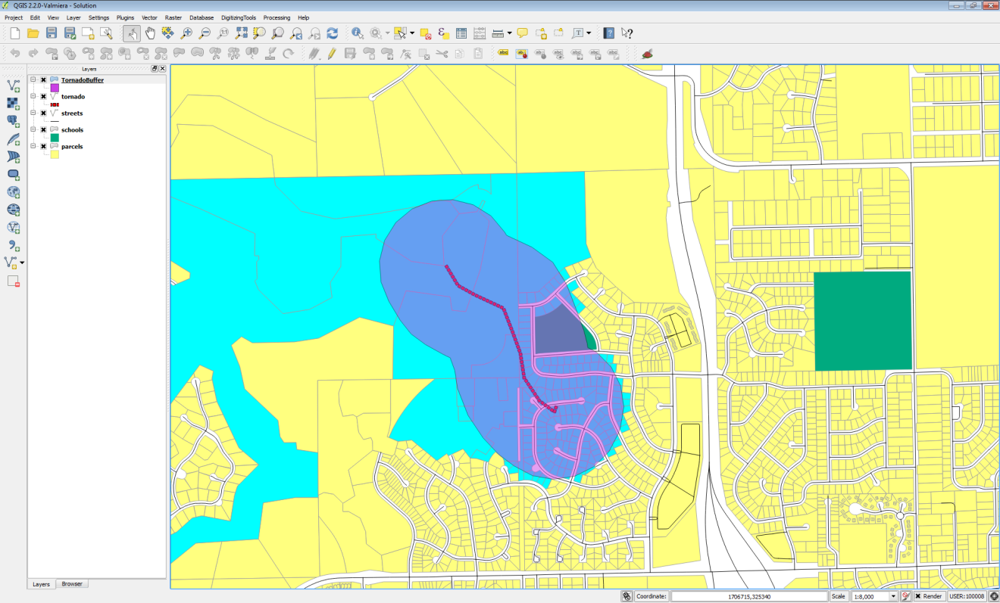

From here, you could save out the selected parcels as a new shapefile. To do this you would right click on the parcel layer and choose Save selection as… You could also open the parcel attribute table and Show Selected Features to examine the attributes of those affected parcels. 

5.	Finally you’ll examine the total value of the affected parcels. From the menu bar choose Vector -> Analysis Tools -> Basic Statistics.
 
	a.	Select parcels as the Input Vector Layer. 

	b.	Check Use only selected features.
 
	c.	Set the Target Field to TOTALVAL

	d.	Click OK

6.	The results are shown in the figure below. Now you know the total value of the affected parcels! This is a great example of how you can generate information from GIS data.

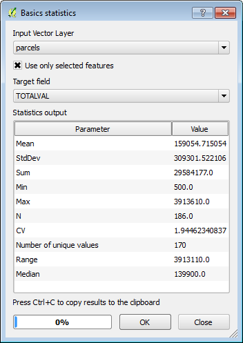

### 5 Conclusion
In this lab, you explored the use of data dictionaries with coded field names. You experienced another example of using attribute table queries. In Task 2 you used a buffer operation combined with a select by location operation to determine to total value of parcels impacted by a tornado. 

### 6 Discussion Questions

1.	Why do we need data dictionaries?
2.	How are Attribute selections Useful in a GIS?
3.	Why are buffering and spatial selections important to us?

### 7 Challenge Assignment

Repeat the steps in Task 2.2 to determine the roads that were impacted by the tornado. Report the affected road names to your instructor. Make a map composition of both the impacted roads and parcels. Turn in the final map to your instructor.

